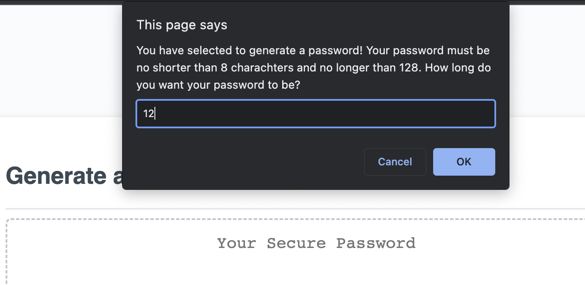
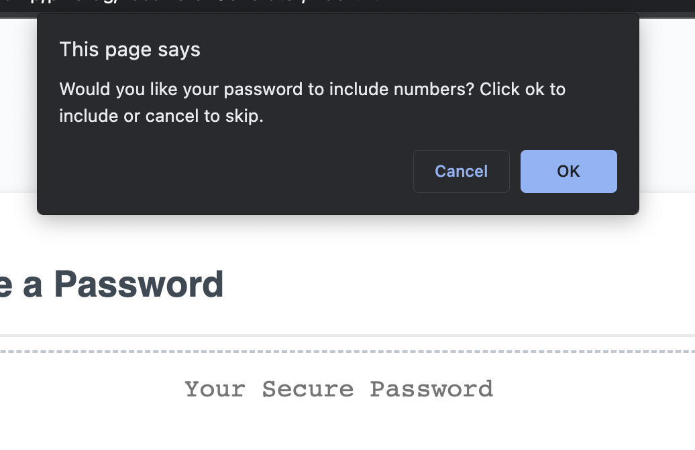
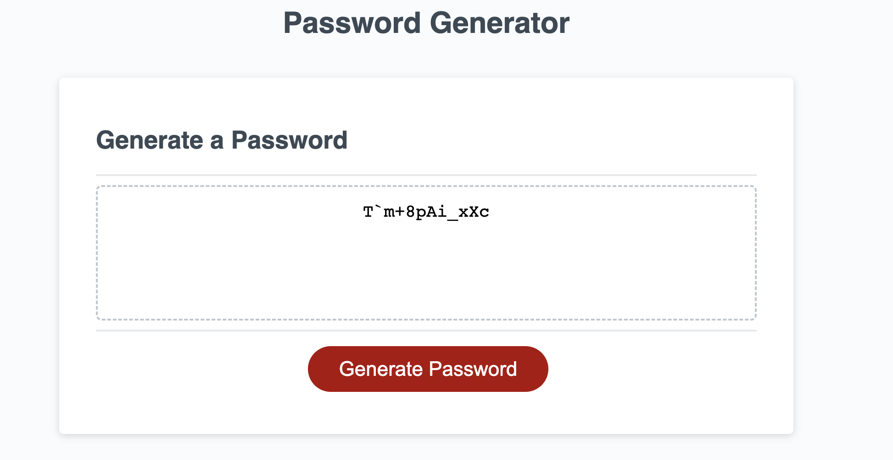

# Password-Generator

## Goals
The goals of this project was to create a password generator using JavaScript that would generate passwords of a certain length and character type based on user input. In order for the project to be successful the generator must:

1. Create passwords that are betweeen 8 and 128 characthers in length. 
2. Users can select characters to include. Options are numbers, lower case letters, upper case letters, and specail characters. 
3. Once the password is generated it will be displayed in the given html element. 

## Implementation

I began by creating a space for user input using `window.prompt` that would request the desired length of password from the user. This input will then be checked to ensure that it is numerical only and that it is not less than 8 nor more than 128 as directed. I also added a modulo comparision to ensure the number entered was whole. 

```
  if (isNaN(length) || length < 8 || length > 128 || length % 1 != 0 ) {
    alert("You have entered a number outside the acceptable range or have entered something other than a number. Please try again.")
    return;
  }

```

Next I created a series of prompts using the `window.confirm` method to collect the remaining password criteria.  Using the `concat` method, the users response will join the corresponding charachter arrays to a new seperate array to generate the characher pool for the password. After, a final check is run to make sure at at least one selection was made by examining the length of this final array. 

```
 if (selection.length == [0]) {
    alert("Oh no! You must select at least one type for a password to generate. Please try again.");
    return;
  }

```

 I then took the new array and, using a for loop and the `Math Random` and `Math Floor` functions, randomly selected characters of the users desired length from the avaialble pool and retunred them to the designated text area in the browser. 

```

  for (var i = 1; i <= length; i++) {
    var randomPick = Math.floor(Math.random() * selection.length);
    pword += selection[randomPick];
   }

   return(pword);

```
## Deployed Application

# Below are some images from the depolyed application.







## License
MIT    

## Installation
NA

## Usage
NA

## Credits
The HTML,CSS, and first 14 lines of the JS file were provided as part of course. 
